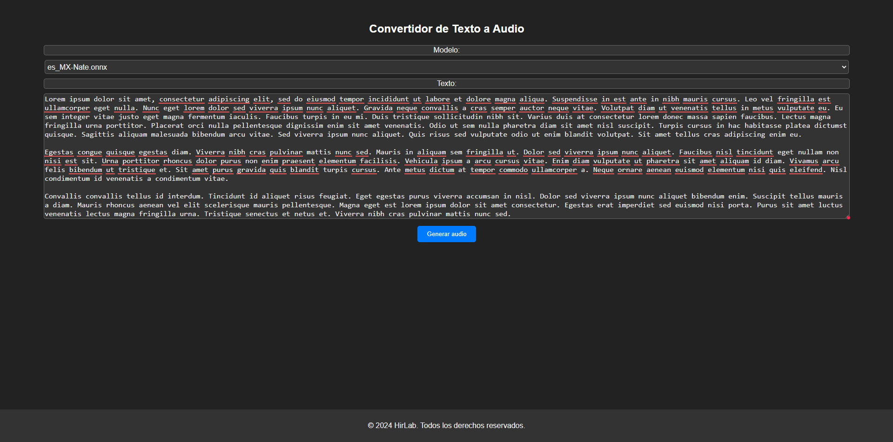

## Introducción

Bienvenido a la documentación de la aplicación de síntesis de voz utilizando Piper. Esta aplicación permite convertir texto a voz en varios idiomas y acentos utilizando modelos de síntesis de voz personalizados y públicos, dichos modelos deben de ser basados en el formato .onnx compartible con Piper. Además, utiliza el framework Flask para crear una interfaz web interactiva y la biblioteca Hugging Face para descargar y utilizar todos los modelos de síntesis de voz.


## Despliegue de App

Para desplegar la aplicación, sigue los pasos a continuación:

1. Clona el repositorio en tu servidor:

```
git clone https://github.com/HirCoir/HirCoir-Piper-tts-app.git
```

2. Haz un `cd` al repositorio clonado:

```
cd HirCoir-Piper-tts-app
```

3. Construye el contenedor de Docker:

```
docker build --build-arg TOKEN_HUGGINGFACE=tu-token-de-huggingface --build-arg REPO_HUGGINGFACE=tu-repo-de-huggingface .
```

En este paso, proporcionas tu token de Hugging Face para descargar los modelos de voz privados y el repositorio de Hugging Face donde se encuentran tus modelos de voz personalizados. Si no tienes modelos personalizados, simplemente ignora la variable de entorno `--build-arg TOKEN_HUGGINGFACE=tu-token-de-huggingface --build-arg REPO_HUGGINGFACE=tu-repo-de-huggingface`.

4. Correr el contenedor:

```
docker run -d --name tts-app -p 7860:7860 tts-app
```

Esto ejecutará la aplicación en el puerto 7860 y le permitirá acceder a ella en su navegador web en `localhost:7860`.

## Consideraciones importantes

- Asegúrate de que Docker y Git están instalados en tu servidor antes de ejecutar estos comandos.
- No compartas tu token de Hugging Face con nadie. Es sensible y si alguien lo utiliza mal podría causar problemas en tu cuenta de Hugging Face.
- Los modelos de síntesis de voz de Hugging Face pueden ser pesados y tomar tiempo en descargarse. Por favor, ten paciencia.

## Contribuir

Si tienes sugerencias para mejorar la aplicación, considera abrir un issue o hacer un pull request en el repositorio. Esto me ayudará a mejorar la aplicación y proporcionar una mejor experiencia de usuario.

## Créditos

Gracias al desarrollador de la aplicación original y a los creadores de los modelos de síntesis de voz. Sin su dedicación y esfuerzo, esta aplicación no sería posible.

## Licencia

La aplicación es de código abierto y se distribuye bajo la licencia MIT. Consulta la licencia para más detalles.
